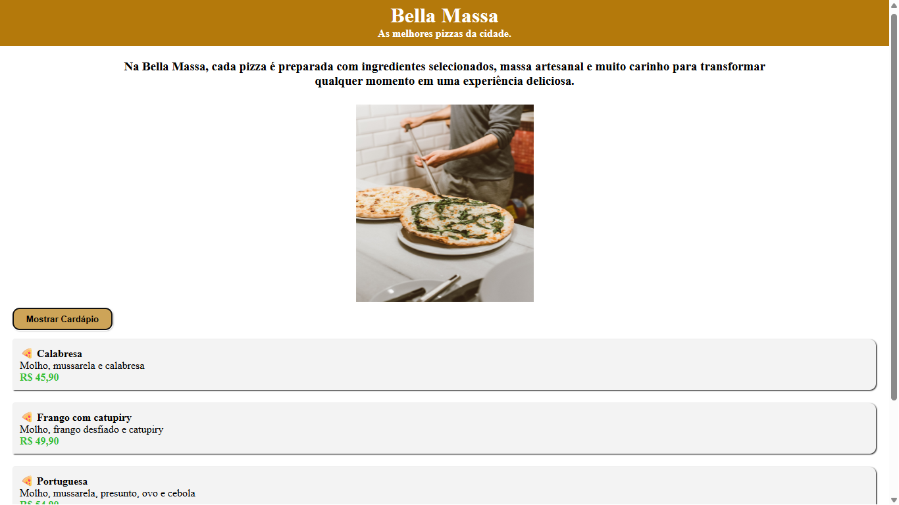

# 🍕 Bella Massas

Projeto desenvolvido utilizando React para praticar conceitos de componentes, organização de código e construção de interfaces.

## Preview



## Funcionalidades

- Página inicial
- Cardápio
- Layout responsivo

## Tecnologias

- React
- JavaScript
- CSS3
- HTML5

## Como executar

```bash
npm install

npm run dev
```
